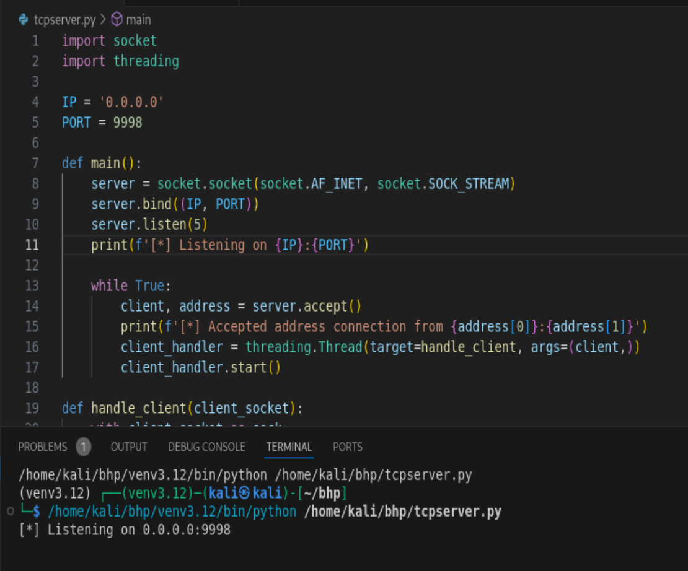

## TCP Client Trouble

I'll start off with a huge frustration that left me tearing my hair out for hours, but had a simple solution. The VirtualBox just would not load correctly. It said there were loads of errors that wouldn't let me get passed the sign-in page. I searched everywhere online, worked with ChatGPT and Claude to figure out if there was anything I was missing. Worked through loads of error messages.

Turned out, it was just because I had a second screen. As soon as I disconnected my second monitor, it all worked fine. FFS. From what I can find out, this may be due to graphic controllor compatibility (VB not good at managing both displays) and configuration conflicts. 

This is a little frustrating as it makes it really difficult to copy/paste the code or type it into the VirtualBox working on just the one screen :D. 

Anyway, once this was done, I was able to get my first little project done, to create a TCP Client which I tested with google.com (though it worked, google.com no longer exists there).

# TCP Client and Server and UDP client
I didn't quite understand what a **'client'** is in computer terms, but I was overcomplicating it in my head - like the business world, is a simply a piece of software that requests a service or resource. 

My next question, requests of whom?, and that is the **'server'**. And this is the ['client-server' model](https://www.geeksforgeeks.org/client-server-model/). The server processes the request and sends the data back to the client. The idea started in the 1960s and was developed through ARPANET.

There are also **'hosts'** which is any networked device, it doesn't have to have a particular role.

From Chapter 2, I was able to get the TCP client and server to work, but when the UDP client just returns nothing. The TCP server though is listening...!

Catch you next time!